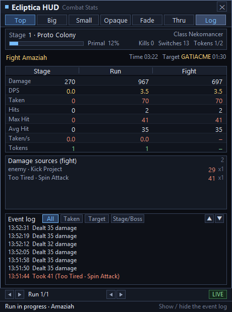

# Ecliptica HUD (C implementation)


A combat-statistics overlay for the VRChat world **Ecliptica**: it follows the VRChat log,
parses combat events in real time, and shows **Stage / Run / Fight** statistics, the boss
target, DPS, damage taken and an event log in a semi-transparent, always-on-top panel.

All data comes from the `output_log` that VRChat writes itself: **no injection, no game
modification, no OSC required**. Implemented in pure C + Win32/GDI, linked only against
`user32` / `gdi32`, with no third-party dependencies.



---

## Contents

- [Features](#features)
- [Quick start](#quick-start)
- [Command-line options](#command-line-options)
- [Interface controls](#interface-controls)
- [Configuration file](#configuration-file)
- [Log parsing rules](#log-parsing-rules)
- [World detection](#world-detection)
- [How it works](#how-it-works)
- [Directory structure](#directory-structure)
- [Tests and verification](#tests-and-verification)
- [Compatibility and limitations](#compatibility-and-limitations)
- [Acknowledgements](#acknowledgements)
- [License](#license)

> 🌐 **Language 言語 语言**：
> [简体中文](README.md) · [English](README.en.md) · [日本語](README.ja.md)

> 📖 **Just want to use it?** See [USAGE.en.md](USAGE.en.md) — a block-by-block walkthrough
> of the interface, how to change every setting (including **how to change the DPS window**),
> and troubleshooting for common problems. This README is about the project and development.

---

## Features

### Three-tier statistics

| Tier | Meaning |
|---|---|
| **Stage** | The current level (accumulated after `now in stage:`) |
| **Run** | From entering the Ecliptica world until leaving it |
| **Fight** | A single boss fight (`Phase2`/`Phase3` of the same boss count as a continuation and are merged) |

Each tier reports: Damage, DPS, Taken, hit count, Max Hit, Avg Hit, Taken/s and Tokens.
DPS uses a switchable sliding window: **3 / 5 / 10 / 30 / 60 / 120 seconds**.
(Earlier versions also had a "Deaths" row; it was removed on request — a death now leaves
only one entry in the event log.)

Multi-form bosses (for example `JimBringer → JimBringerPhase2 → JimBringerPhase3`) come with
two traps, and the program handles both:

- **The kill line arrives late.** In a real log the three-stage fight started at 19:12:21,
  but `Boss JimBringerPhase2 dead` did not show up until 19:12:22. Comparing base names
  alone, that line would end the just-started phase 3 fight and the interface would fall
  back to "No boss fight right now". The program only settles a kill when the **object name
  matches exactly** or the **form number matches**.
- **Each form has a different object name.** Phase 1 is called `JimBringer` and phase 2 is
  called `JimBringerPhase2`, but they share the same base name. Target lookup **matches the
  exact object name first**, then falls back to the base name (taking the most recent
  change); otherwise phase 2 would keep showing a target left over from phase 1.

### Target (aggro) tracking

Parses `ownership of X transferred to Y`, **covering every enemy unit** (bosses, adds,
summons, props). Each object remembers its own last owner, and **a switch is counted only
when that object's target player really changed**, so the same `ownership` line reported over
and over is not counted twice (a `(Clone)` suffix is merged into the same object, while
`Phase2`/`Phase3` count as separate objects).

- The run summary shows the total number of switches
- **During a boss fight only that boss's own target counts**; while the log has no
  `ownership` for it yet the panel shows `Target —` and never substitutes another enemy's
  target (see below)
- Outside a boss fight it reports the most recent switch together with the object name
  (`Ice Squid → zukkiii 00:12`)
- The event log records `Target switch <object> → <player>`

> **Where a boss fight's "initial target" comes from.** A target can only come from an
> `ownership` line. Measured across bosses, the gap between the start of a fight and the
> boss's first `ownership` line varies a lot: 2 seconds for Nan, 3 for Gravetender,
> 8 for Steven, 13 for Despair, 17 for DarkMouth, 20 for JackedPumpkin, while
> **FlyLord takes 57 seconds** (it opens with INTRO SLAP and a swarm of `Fly` adds).
> During those 57 seconds the log really does have no target data for that boss, so the
> program shows `—` rather than borrowing the previous stage's enemy target — which is
> precisely why the old version looked like it "could not identify the initial aggro target".

> **Note: target tracking depends on `ownership` lines appearing in the log.**
> The official world emits them; if some world does not, Target shows `—` and the switch
> count stays at 0. That data is missing from the log, it is not a parsing or de-duplication
> problem — see [World detection](#world-detection).

### Other

- **Damage source breakdown**: aggregates damage taken for the current fight / stage / run
  by `attacker · move`, shown as **`per-hit damage x hit count`** (the total is one
  multiplication away)
- **Current boss target**: in the target row the player name is highlighted in gold; names
  longer than 10 characters are collapsed to "first 5 chars…", so the row can never overflow
  or render garbage
- **Event log**: a 512-entry ring buffer, colour-coded by type, with four filters
  (All / Taken / Target / Stage/Boss), click to switch, right-click to cycle, ▲▼ to scroll
- **History browsing**: bottom arrows page through past runs and past boss fights, with a
  badge on the right distinguishing LIVE / HISTORY
- **Overlay interaction**: drag to move, 7 top buttons (including **mouse click-through**),
  a close button, hover tooltips, `Ctrl+Alt+Q` to quit, `Ctrl+Alt+T` to toggle click-through
- **High-DPI aware**: the layout is identical at any scale and never goes soft from system
  bitmap stretching
- **Demo mode**: `--demo` ships a simulated log, so you can look at the whole interface
  without VRChat

---

## Quick start

### Requirements

- Windows 10 / 11 (x64)
- **Either one of**:
  - [MinGW-w64](https://www.mingw-w64.org/) (gcc 8 or newer)
  - Visual Studio 2015 or newer (MSVC)

### Build

**MinGW-w64**

```bat
mingw32-make
```

Three language builds are produced, one per language:

- `mingw32-make` → `ecliptica-hud-c.exe` (Chinese, the default)
- `mingw32-make LANG=en` → `ecliptica-hud-c-en.exe` (English)
- `mingw32-make LANG=ja` → `ecliptica-hud-c-ja.exe` (Japanese)

**MSVC** (from an `x64 Native Tools Command Prompt for VS 2022`)

```bat
build.bat
```

The output is `ecliptica-hud-c.exe` (GUI subsystem, no console window).

### Run

```bat
ecliptica-hud-c.exe
```

Double-clicking is enough: the program looks for the **most recently written**
`output_log*.txt` under `%USERPROFILE%\AppData\LocalLow\VRChat\VRChat\` and starts following
it. Use `ecliptica-hud-c-en.exe` for the English build and `ecliptica-hud-c-ja.exe` for the
Japanese one. To look at the interface first:

```bat
ecliptica-hud-c.exe --demo
```

For detailed instructions (what every part of the interface means, how to change each
setting, how to troubleshoot common problems) see **[USAGE.en.md](USAGE.en.md)**.

---

## Command-line options

| Option | Description |
|---|---|
| (none) | Locate the VRChat log automatically and start following from **near the end** (backing up at most 64 KB as a warm-up; files smaller than 64 KB are read almost in full) |
| `--demo` | Demo mode with built-in simulated events generated in the real log format |
| `--log <file>` | Replay the given log **and keep following appended content**. This option is exclusive: if the file cannot be opened the program does not fall back to auto-detection, it reports "cannot open the file given to --log" and retries every 2 seconds |
| `--from-start` | Read the whole log from the beginning (by default it starts near the end) |
| `--tail` | Move the start position back to "near the end" (the default behaviour). ⚠️ Placed **after** `--log` it makes the replay read only the last 64 KB of that file |
| `--help`, `-h`, `/?` | Pop up help |

> **Option names are case-insensitive**, and `--name` is equivalent to `-name`
> (`--demo` / `--Demo` / `-demo` all work).
> Unrecognised options (for example `--xyz`, or `--log` with the file name missing) **pop up
> help** instead of being silently ignored.
> For detailed usage and measured comparisons see [USAGE.en.md](USAGE.en.md#6-advanced-usage).

### Log discovery order

1. The file given to `--log`
2. The **newest by last-write time** of the `output_log*.txt` files in the
   **VRChat log directory** `%USERPROFILE%\AppData\LocalLow\VRChat\VRChat\`.
   Current VRChat writes only timestamped `output_log_YYYY-MM-DD_HH-MM-SS.txt` files (one per
   session), while older versions wrote `output_log.txt`; the same wildcard covers both.
   If `USERPROFILE` is unavailable it falls back to `%LOCALAPPDATA%\..\LocalLow\...`.
3. Only when step 2 finds nothing at all does it fall back to the newest `output_log*.txt`
   next to the exe / in the current directory / in the exe's parent directory (handy for
   dropping the exe next to a log and replaying it offline)

When VRChat starts a new session (a newer file appears in the directory) the program switches
to following it automatically and wraps up the current run.

---

## Interface controls

| Location | Action |
|---|---|
| Empty area of the panel | Hold and drag to move the window |
| Top buttons | Top / Big / Small / Opaque / Fade / **Thru** / Log |
| ✕ at the top right | Close |
| Event log title bar | Click "All / Taken / Target / Stage/Boss" to switch filters; ▲▼ to scroll |
| Right-click anywhere on the panel | Cycle the event log filter |
| Bottom arrows | Page through past runs (◀ ▶ on the left) and past boss fights (◀ ▶ in the middle) |
| `Ctrl+Alt+T` | Toggle **mouse click-through** globally (works whatever window has focus) |
| `Ctrl+Alt+Q` | Quit globally (works whatever window has focus) |

> The overlay deliberately keeps `WS_EX_NOACTIVATE`, so it **never steals focus from
> VRChat**; to quit, use `Ctrl+Alt+Q` or click ✕. `Esc` only works while the window happens
> to have focus.

### Mouse click-through

After clicking the **Thru** button at the top (or pressing `Ctrl+Alt+T`) the HUD becomes
**completely transparent to the mouse**: clicks, drags and the wheel all land on the window
below, so you can use VRChat or the desktop normally while the HUD keeps displaying.

It is implemented by adding `WS_EX_TRANSPARENT` to the layered window and making
`WM_NCHITTEST` return `HTTRANSPARENT` as a second line of defence.

> ⚠️ Once click-through is on, the window **receives no mouse messages at all**, so the
> button can no longer be clicked to turn it off. The program permanently shows
> `Click-through · Ctrl+Alt+T` in the title bar; press `Ctrl+Alt+T` to restore.
> The state is saved to `config.ini` and reused the next time you start.

---

## Configuration file

The configuration file is a UTF-8 `config.ini`, written back on exit. Its location is decided
in the following order:

1. **Portable mode** — if a **writable** `config.ini` already exists next to the exe, that
   file is used directly. To keep the configuration with the program (USB stick, portable
   copy), just put `config.ini` beside the exe.
2. **Per user (default)** — `%APPDATA%\EclipticaHUD-C\config.ini`
   (falling back to `%LOCALAPPDATA%` if `%APPDATA%` is unavailable); the directory is created
   automatically.

> **Why not default to the exe's own directory**: if the exe is installed in a directory such
> as `C:\Program Files`, an ordinary user simply cannot write there (x64 processes get no UAC
> virtualisation) and the settings would be lost silently; and in a shared writable directory
> **different Windows users on the same machine would overwrite each other's** window
> position and other settings.
>
> The directory name carries `-C` to keep it apart from the upstream Rust version's
> `%APPDATA%\EclipticaHUD\` (which holds `pos.txt` / `scale.txt` / `top.txt` / `logpos.txt`),
> so the two programs can never collide on file names later.

```ini
# Ecliptica HUD (C) config - UTF-8
always_on_top=1
alpha=210
scale=100
stat_window=10
show_event_log=0
click_through=0
win_x=538
win_y=71
ev_filter=0
# world_names: extra Ecliptica-family world names, separated by | or ,
world_names=
```

| Key | Values | Description |
|---|---|---|
| `always_on_top` | 0 / 1 | Keep the window on top |
| `alpha` | 40 – 255 | Overall opacity |
| `scale` | 60 – 200 | Interface scale in percent |
| `stat_window` | 3 / 5 / 10 / 30 / 60 / 120 | DPS window (seconds) |
| `show_event_log` | 0 / 1 | Whether the event log panel is shown |
| `click_through` | 0 / 1 | Mouse click-through (equivalent to clicking the **Thru** button at the top) |
| `win_x` / `win_y` | integers | Window position, `-1` means auto-centred and slightly above centre |
| `ev_filter` | 0 – 3 | Event log filter (All / Taken / Target / Stage/Boss) |
| `world_names` | string | Extra Ecliptica-family world names, separated by `\|` or `,` |

> There is no "DPS window" button among the top buttons any more, so to change
> `stat_window` edit `config.ini` directly (it is written back on exit, so close the HUD
> first).

---

## Log parsing rules

The parser prefix-matches the **message body** of VRChat log lines (VRChat logs are BOM-less
UTF-8 and contain Chinese world names and Chinese/Japanese player names). Every pattern below
is taken from a real `output_log`:

| Event | Log pattern |
|---|---|
| Entering a world | `[Behaviour] Entering Room: <world name>` |
| Leaving a world | `[Behaviour] OnLeftRoom` / `VRCApplication: HandleApplicationQuit` |
| Stage start | `ECLIPTICA - now in stage: Stage_ProtoColony on phase: 0.1228879 as class: Nekomancer` |
| Intermission | `ECLIPTICA - now in intermission` |
| Lobby | `ECLIPTICA - now in lobby` |
| Boss fight start | `ECLIPTICA - now fighting boss: Amaziah(Clone) on phase: 0.4321299` |
| Boss kill | `Boss FlyLord dead, personal damage dealt:` |
| Kill settlement | `STRIKE DMG: 4793` / `NON-STRIKE DMG: 615` |
| Damage dealt | `Dealing 74 STRIKE damage` / `Dealing 38 NON-STRIKE damage` |
| Damage taken | `damage has been taken: 43, from source: (Peltapod) attack_Slam` |
| Target (aggro) switch | `ownership of Amaziah transferred to OtherPlayer` |
| Death | `Local controller dead, switching off.` (written to the event log only, never counted in the statistics) |
| Token | `spawn token, True, 55` + `ECLIPTICA saving SESSION ID 11508` |
| Enemy pool | `Initializing Enemy POOL ID17 as ENEMY ID 87` / `Retiring Enemy POOL ID19` |

### Eight easy traps

**Death spam.** A single death floods the log with dozens of `Local controller dead,
switching off.` lines (34 lines within 8 seconds, measured), with unrelated lines such as
`ECLIPTICA saving SESSION ID` mixed in. The program requires "proof of being alive again
after the previous death (damage dealt / damage taken / stage change / boss fight started /
token spawned)" and adds a 3-second quiet period on top.

> The death count **is no longer part of the statistics** (there is no Death row in the
> panel). This de-duplication now only serves the **event log**: one death writes exactly one
> "You died" entry, otherwise the log would be buried under those dozens of repeated lines.

**The kill line for multi-form bosses arrives late.** Measured: `JimBringerPhase3` started at
19:12:21 and `Boss JimBringerPhase2 dead` did not appear until 19:12:22. When settling a kill
the program requires an exactly matching object name or a matching form number, otherwise
that line would misjudge the just-started phase 3 as finished (the interface returning to "no
boss fight right now"). By the same token, target lookup matches the object name exactly
first — `JimBringer` / `JimBringerPhase2` / `JimBringerPhase3` are three different objects,
otherwise phase 2 would show a target left over from phase 1.

**Intermission damage hits a training dummy and must not count.** The only thing you can hit
during an intermission (`now in intermission`) is the practice dummy, and the log keeps
spamming `Dealing 30 STRIKE/NON-STRIKE damage` — one measured intermission produced more than
20 such lines. That damage **counts towards no tier of the statistics**, otherwise run damage
would gain several hundred points out of nowhere.

**After a wipe you return to the starting lobby and the data must be reset.** Two criteria:
① an intermission starts while the boss is still alive (the fight did not end with a kill);
② at least one stage has already been played and `Stage_Hall of Beginnings` appears again
(you were sent back to the starting lobby). When either hits, the run is closed as FAILED and
**a new run starts immediately**, with all three tiers and the stage number reset to zero;
the failed run stays in the history and can be browsed with the bottom ◀ ▶. In the measured
`output_log_2026-09-21_15-24-01` the stage sequence is
`GMBigcity | Bringer | Hall of Beginnings | GMFuncFlat | …`, with the starting lobby appearing
as the third stage — exactly a wipe and restart.

**The damage source shows per-hit damage, not a running total.** The row format is
`per-hit damage x hit count`. A running total combined with `xN` is easily read as "N points
landed N times" — measured, `enemy · hit` (a DoT whose `from source:` is empty in the log)
totalled 20 points over 20 hits, and the old version displayed `20 x20`, which looked like 20
points every single time. With the per-hit value it reads `1 x20`, which is self-consistent
and lets you multiply the total out yourself.

**Hit counts have to be carried along when aggregating.** When merging per-stage and
per-fight sources into the Run view, passing only the total damage degrades the count into a
"number of entries" and the per-hit damage comes out too large. The reference implementation
passes two values, `(total, hits)`, and this project's `tally_add()` likewise requires the
`n_hits` argument.

**Over-long player names used to be sliced into garbage.** The longest player name in the
measured logs has 14 Japanese/Chinese characters (42 bytes in UTF-8), while `Event.cls`
originally held only 32 bytes: truncating by bytes cuts through a multi-byte character and
leaves half of one, which the interface renders as a **garbage box that also pushes out the
duration behind it**. There are now two layers: ① `copy_span()` backs off trailing
continuation bytes when truncating, so no path can produce invalid UTF-8; ② the display layer
uses `names_shorten()` to collapse names longer than 10 **characters** to "first 5 chars…".
The statistics still keep the full name internally.

**Name mapping.** The reference implementation's display-name mappings are built in, for
example
bosses: `FlyLord → Beelzebub`, `AntKing → Khepri`, `Obisidus → Irides`,
`ManalyteAncient → Abaddon`;
stages: `ProtoColony → Proto Colony`, `VRCHub → VRChat Hub`;
progress stages: `0.43 → Antumbral`;
damage sources: `(Khepri) attack_Claws2 → Khepri · Claws 2`, `NukeHitbox (BIG) → Nuke (big)`.

---

## World detection

The official world names are `Ecliptica …`. The program **does not hard-code the room name**;
two layers guarantee this:

1. **World alias table** — the built-in official name is `ecliptica`; to recognise other
   worlds of the same family by room name, register them yourself under `world_names` in
   `config.ini` (`|` or `,` separated). A hit starts a run immediately.
2. **Lazy start** — any `ECLIPTICA …` combat log line starts a run automatically. So even if
   the room name is not in the alias table, or the HUD only starts following from the tail of
   the log and never sees the room line at all, everything still works.

### Availability of target tracking

**Target (aggro) tracking depends on `ownership of X transferred to Y` lines appearing in the
log.** The official world emits them; if some world does not, Target shows `—` and the switch
count stays at 0, while every other statistic remains completely correct. The program cannot
infer data that is not in the log.

---

## How it works

```
VRChat output_log.txt
        │  vlog.c   locate + follow incrementally (reopen on log rotation)
        ▼
     parse.c      log line → combat event (stateless prefix matching)
        ▼
     stats.c      stage / run / fight three-tier model + sliding DPS window + history
        │            ├─ evlog.c   event log ring buffer
        │            └─ evtext.c  event → readable text
        ▼  stats_view()  aggregate into a read-only snapshot
     hud.c        layout computation + GDI double-buffered drawing
        ▼
     overlay.c    layered transparent window / message loop / interaction
```

### Rendering and scaling

The memory DC uses the `MM_ANISOTROPIC` mapping to scale the **460×620 logical coordinate
space** uniformly to window pixels, then multiplies by the system DPI factor. Fonts, spacing
and buttons therefore keep **one single layout** at any scale from 60% to 200%, with no
misplaced text; before `BitBlt` the mapping is reset to `MM_TEXT` so the source rectangle is
not scaled a second time.

### Layout

Every block rectangle is computed in one go by `hud_layout()`, and **drawing and hit-testing
share the same rectangles**, which structurally rules out panels covering each other:

```
Title row(26) → Button row(27) → Stage/Progress(42) → Fight Boss(22)
→ Three-tier table(header 18 + 8×19) → Damage sources(adaptive) → [Event log(optional 142)]
→ History pager(26) → Bottom status bar(22)
```

When the event log is hidden, the freed height is given to the **Damage sources** list (up to
14 rows).

---

## Directory structure

```
src/
├── main.c     entry point: command-line parsing, config load/save, world alias registration
├── overlay.c  overlay window: layered transparency, always-on-top, DPI, message loop, log polling wiring
├── hud.c      HUD layout computation + GDI double-buffered drawing + hit testing
├── cfg.c      config.ini read/write (UTF-8)
├── vlog.c     log discovery and incremental following (VRChat directory first, reopen on rotation)
├── parse.c    log line → combat event
├── names.c    boss/stage/progress-stage name mapping, source prettifying, world name detection
├── stats.c    statistics model: three tiers + sliding DPS window + history + target tracking
├── evlog.c    event log ring buffer
├── evtext.c   event → event log text (shared by overlay and preview)
├── format.c   number/time formatting (no Windows dependency, unit-testable)
├── zhtext.h   Chinese interface strings
└── compat.h   compiler compatibility shim (MSVC / MinGW)
test_core.c    logic tests + log replay summary tool
preview.c      off-screen interface preview tool
使用说明.md     Chinese user manual
USAGE.en.md    English user manual (interface walkthrough / settings / FAQ)
testdata/      regression fixtures (alt_world.log: a log sample whose room name differs from the official one)
```

---

## Tests and verification

### Unit tests

```bat
mingw32-make test
```

Covers the parser, name mapping, world detection, formatting, three-tier statistics, the DPS
window, stage transitions, boss continuation, target tracking, over-long player names,
intermission dummies, wipe resets, cross-world handling and the event log — **242 checks** in
total.

### Log replay summary

```bat
test_core.exe <log file>
```

Prints the event count, the number of accepted target switches and the per-run statistics,
which makes it easy to calibrate against real logs:

```
lines=1552  events=415  accepted=375
ownership: parse 0 -> keep 0 (per-object, target really changed)
runs=1  in_run=0  stage_no=1  targets_total=0
all runs: kills=1  targets=0
run: dmg=3188 taken=453 hits=46 tokens=1 fights=1 stages=1
```

### Off-screen interface preview

```bat
mingw32-make preview
preview.exe <log> <scale%> <with log panel 0/1> <output.bmp> [replay only the first N lines]
```

It replays a log into a statistics state and renders it to an image, so **you can check the
layout without a monitor** and compare versions directly while changing the interface.

### Verified items

| Item | Result |
|---|---|
| Build | MinGW-w64 8.1.0, `-Wall -Wextra` **zero warnings, zero errors** |
| Unit tests | **all 242 checks pass** |
| Real log replay | a single 53834-line log parses into **9359 events** |
| Auto-discovery | started with no arguments it follows the `output_log_*.txt` with the newest mtime in the VRChat directory |
| Session rotation | after a newer log file is created while running it switches to following it automatically |
| Death de-bounce | 34 death lines within 8 seconds → the event log gets **1 entry** (deaths are no longer counted in the statistics) |
| Intermission dummy | 20+ `Dealing 30` lines during an intermission: run damage is **completely unchanged** across it (measured 4,965 → 4,965) |
| Wipe reset | in real logs both "an intermission while the boss is still alive" and "`Hall of Beginnings` outside the first stage" are recognised; the run resets to zero and leaves a FAILED history entry |
| Initial boss target | `FlyLord` shows `Target —` for the first 57 seconds after the fight starts and no longer borrows the previous stage's enemy (the old version showed `LavaSac → …`) |
| Target tracking | 1544 `ownership` lines in a single log → **1342** accepted after per-object de-duplication |
| World detection | a room name different from the official one is not misdetected; with `world_names` registered a run starts on entering the room, without it the run starts lazily from `ECLIPTICA` log lines |
| Interface | layouts at 100% / 150% scale render identically off-screen; on real hardware the display is correct with DPI awareness |
| Interaction | filter buttons switch on click, clicking a button does not accidentally start a drag, `WM_CLOSE` exits gracefully and writes the config back |
| Mouse click-through | verified on real hardware: after clicking **Thru**, `GWL_EXSTYLE` has `WS_EX_TRANSPARENT` set, `WM_NCHITTEST` returns `HTTRANSPARENT`, and `WindowFromPoint` at the window centre hits the **window below**; `Ctrl+Alt+T` restores everything with the window position unaffected |
| Multiple users | config path resolution verified in four scenarios: no config beside the exe → per-user directory; writable config beside the exe → portable mode; read-only config beside the exe (simulating Program Files) → automatic fallback to the per-user directory; save/load round-trips consistently |

---

## Compatibility and limitations

### Multiple users / multiple accounts

The program has **no hard-coded user paths** internally; every user-related location is
resolved from environment variables, so different Windows users on the same machine **do not
interfere with each other**:

| Data | Location | Per-user isolated |
|---|---|---|
| VRChat log | `%USERPROFILE%\AppData\LocalLow\VRChat\VRChat\` | ✅ resolved at runtime from `USERPROFILE` |
| This program's config (window position / scale / opacity / filter…) | `%APPDATA%\EclipticaHUD-C\config.ini` | ✅ per user |
| Interface DPI / screen size | queried at runtime | ✅ per session |

- Different users (including simultaneous logins via Fast User Switching) each follow their
  own log and save their own position.
- In portable mode (a `config.ini` next to the exe) the configuration is shared — this is
  intentional portable behaviour; if several people want their own, delete the `config.ini`
  next to the exe to return to per-user mode.
- Two instances under the same user: the two windows overlap and the second instance fails to
  register `Ctrl+Alt+Q` (closing with ✕ still works); on exit, whichever closes last writes
  the config.

### Other

- **Windows only** (Win32 + GDI); no cross-platform support.
- The log records only damage **you** dealt, so other players' DPS cannot be displayed.
- **Target (aggro) tracking depends on the log emitting `ownership` lines**; without them
  Target shows `—`. That data is simply not in the log and the program cannot infer it.
- It depends on the VRChat log format; if a world update changes the emitted patterns,
  `src/parse.c` has to be adjusted accordingly.
- The SteamVR overlay and Discord Rich Presence are not implemented.
- The overlay is a tool window that does not steal focus, and its quit hotkey is fixed at
  `Ctrl+Alt+Q`.

---

## Acknowledgements

- **[EclipticaHUD](https://github.com/RealWhyKnot/EclipticaHUD)** — the Rust reference
  implementation. This project's knowledge of the log format and its boss / stage /
  progress-stage name mappings all follow it. Thanks are due.
- The author of the Ecliptica world and the community players.

---

## License

[MIT](LICENSE)
