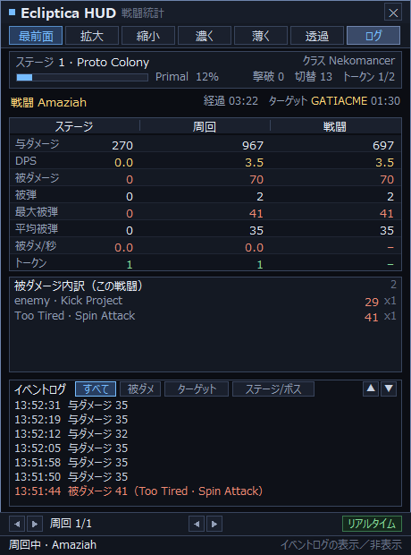

# Ecliptica HUD（C 言語実装）


VRChat ワールド **Ecliptica** の戦闘統計オーバーレイ：VRChat のログを追いかけ、
戦闘イベントをリアルタイムに解析し、半透明の最前面パネルに
**ステージ / 周回 / 戦闘（Boss 戦）**の 3 階層の統計、Boss ターゲット、DPS、被ダメージ
とイベントログを表示します。

すべてのデータは VRChat 自身が書き出す `output_log` に由来します：**インジェクションなし、
ゲームの改変なし、OSC も不要**。純 C + Win32/GDI 実装で、リンクするのは `user32` / `gdi32`
だけで、サードパーティ依存は一切ありません。



---

## 目次

- [機能](#機能)
- [クイックスタート](#クイックスタート)
- [多言語版](#多言語版)
- [コマンドライン引数](#コマンドライン引数)
- [画面操作](#画面操作)
- [設定ファイル](#設定ファイル)
- [ログ解析ルール](#ログ解析ルール)
- [ワールド認識](#ワールド認識)
- [動作原理](#動作原理)
- [ディレクトリ構成](#ディレクトリ構成)
- [テストと検証](#テストと検証)
- [互換性と制限](#互換性と制限)
- [謝辞](#謝辞)
- [ライセンス](#ライセンス)

> 🌐 **言語 Language 语言**：
> [简体中文](README.md) · [English](README.en.md) · [日本語](README.ja.md)

> 📖 **とにかく使ってみたい方へ。** [USAGE.ja.md](USAGE.ja.md) をどうぞ —— 画面の各ブロックの
> 意味、各設定の変え方（**DPS 集計時間の調整方法**を含む）、よくあるトラブルの調べ方を
> 説明しています。この README はプロジェクト紹介と開発者向けの内容が中心です。

---

## 機能

### 3 階層の統計

| 階層 | 意味 |
|---|---|
| **ステージ Stage** | 現在のステージ（`now in stage:` 以降の累計）|
| **周回 Run** | Ecliptica ワールドに入ってから出るまでの 1 回 |
| **戦闘 Fight** | 1 回の Boss 戦（同一 Boss の `Phase2/Phase3` は続戦とみなして合算）|

各階層で表示するのは：与ダメージ、DPS、被ダメージ、被弾回数、最大被弾、平均被弾、被ダメ/秒、トークン。
DPS は切り替え可能なスライディングウィンドウを使います：**3 / 5 / 10 / 30 / 60 / 120 秒**。
（初期のバージョンには「死亡」の行もありましたが、要望により削除しました —— 死亡はイベントログに
1 件記録が残るだけです。）

多形態 Boss（例えば `JimBringer → JimBringerPhase2 → JimBringerPhase3`）には 2 つの
落とし穴があり、どちらもプログラム側で対処しています：

- **撃破行は遅れてやってくる。** 実際のログでは 3 段階目が 19:12:21 に開戦しているのに、
  `Boss JimBringerPhase2 dead` は 19:12:22 まで現れません。基本名だけで比較すると、この行が
  始まったばかりの 3 段階目をその場で終わらせてしまい、画面は「現在 Boss 戦はありません」に
  なります。プログラムは**オブジェクト名が完全一致**するか**形態番号が一致**する場合だけ決算します。
- **形態ごとにオブジェクト名が違う。** 1 段階目は `JimBringer`、2 段階目は `JimBringerPhase2` で、
  基本名は同じです。ターゲットの照会は**まずオブジェクト名の完全一致**を試し、次に基本名へ
  退避します（その際は最後に変化した 1 件を採用）。そうしないと 2 段階目に 1 段階目の
  ターゲットが残り続けます。

### ターゲット（ヘイト）追跡

`ownership of X transferred to Y` を解析し、**すべての敵ユニット**（Boss、雑魚、召喚物、
オブジェクト）を対象にします。オブジェクトごとに前回の所属を記憶し、**そのオブジェクトの
ターゲットが実際に変わったときだけ 1 回**数えるので、同じ `ownership` が繰り返し報告されても
二重計上しません（`(Clone)` の接尾辞は同一オブジェクトに統合し、`Phase2/Phase3` はそれぞれ
別オブジェクトとして扱います）。

- 周回の集計では切替回数の累計を表示
- **Boss 戦中はその Boss 自身のターゲットだけを認める**。ログにまだその Boss の `ownership` が
  ないときは `ターゲット —` と表示し、他の敵のターゲットで偽装することは決してしません（下記参照）
- Boss 戦中でないときは、直近の切替をオブジェクト名付きで報告（`Ice Squid → zukkiii 00:12`）
- イベントログには `ターゲット切替 <オブジェクト> → <プレイヤー>` を記録

> **Boss 戦の「最初のターゲット」はどこから来るのか。** ターゲットは `ownership` 行からしか
> 得られません。実測では、各 Boss が開戦から自身の最初の `ownership` を出すまでの間隔は
> 大きく異なります：Nan 2 秒、Gravetender 3 秒、Steven 8 秒、Despair 13 秒、DarkMouth 17 秒、
> JackedPumpkin 20 秒、そして **FlyLord は 57 秒**（最初に INTRO SLAP と一群の `Fly` 雑魚を
> 出します）。この 57 秒の間、ログにその Boss のターゲットデータは確かに存在せず、プログラムは
> `—` を表示し、前段階の敵のターゲットを借りたりはしません —— 旧版が「最初のヘイトターゲットを
> 認識できない」ように見えたのは、まさにこのためです。

> **注意：ターゲット追跡はログに `ownership` 行が現れるかどうかに依存します。**
> 公式ワールドは出力しますが、出力しないワールドでは「ターゲット」が `—` を表示し、切替回数は
> 常に 0 になります。これはログにそのデータがないのであって、解析や重複排除の問題ではありません
> —— 詳しくは [ワールド認識](#ワールド認識) を参照。

### その他

- **被ダメージ内訳**：`攻撃者 · 技` 単位で戦闘 / ステージ / 周回の被ダメージを集計し、
  **`単発ダメージ x 命中回数`** の形で表示（累計値はその場で掛け算できます）
- **Boss の現在ターゲット**：ターゲット行ではプレイヤー名を金色で強調。名前が 10 文字を
  超える場合は「先頭 5 文字…」に短縮し、行幅を押し広げたり文字化けを出したりしません
- **イベントログ**：512 件のリングバッファ、種類ごとに色分け、4 つのフィルタ（すべて / 被ダメージ /
  ターゲット / ステージ·Boss）、クリックで切替、右クリックで循環、▲▼ で閲覧
- **履歴の閲覧**：下部の矢印で過去の周回と過去の Boss 戦を閲覧、右側のバッジが「リアルタイム / 履歴」を区別
- **オーバーレイの操作**：ドラッグで移動、上部 7 ボタン（**マウス透過**を含む）、閉じるボタン、ホバーヒント、
  `Ctrl+Alt+Q` で終了、`Ctrl+Alt+T` でマウス透過の切替
- **高 DPI 対応**：どの拡大率でもレイアウトが一致し、システムのビットマップ拡縮によるぼやけが出ません
- **デモモード**：`--demo` に内蔵の模擬ログを使い、VRChat なしで画面全体を確認できます

---

## クイックスタート

### 動作環境

- Windows 10 / 11（x64）
- **次のいずれか**：
  - [MinGW-w64](https://www.mingw-w64.org/)（gcc 8 以降）
  - Visual Studio 2015 以降（MSVC）

### ビルド

**MinGW-w64**

```bat
mingw32-make
```

**MSVC**（`x64 Native Tools Command Prompt for VS 2022` で）

```bat
build.bat
```

生成物は `ecliptica-hud-c.exe`（GUI サブシステム、コンソールウィンドウなし）。

### 多言語版

画面テキストは**簡体中文 / English / 日本語**の 3 種類があり、ソースは 1 つを共用して
`src/zhtext_*.h` だけが異なります。ビルド時に `LANG` で選択します：

```bat
mingw32-make                  :: 中国語（既定）-> ecliptica-hud-c.exe
mingw32-make LANG=en          :: 英語          -> ecliptica-hud-c-en.exe
mingw32-make LANG=ja          :: 日本語        -> ecliptica-hud-c-ja.exe

build.bat                     :: MSVC：中国語
build.bat en                  :: MSVC：英語
build.bat ja                  :: MSVC：日本語
```

対応するドキュメント：

| 言語 | マニュアル |
|---|---|
| 簡体中文 | [README.md](README.md) · [使用说明.md](使用说明.md) |
| English | [README.en.md](README.en.md) · [USAGE.en.md](USAGE.en.md) |
| 日本語 | [README.ja.md](README.ja.md) · [USAGE.ja.md](USAGE.ja.md) |

実装の要点：

- 3 言語は同じマクロ名（`TXT_*`）を共用し、`src/zhtext.h` が `UI_LANG_EN` /
  `UI_LANG_JA` に応じて対応するテキストテーブルへ振り分けます。ソースに文字列を直書きしません。
- 中間ファイルは言語ごとにディレクトリを分け（`build/<lang>/`）、言語を切り替えても
  古いオブジェクトファイルが混ざりません。
- **フォントは言語ごとに選択し、フォールバックチェーンを持ちます**：中国語は `Microsoft YaHei`、
  日本語は `Meiryo UI`、英語は `Segoe UI`。先頭のフォントが存在しない場合は、システムに
  実際に入っている中国語 / 日本語フォントへ順に退避し、ログ内の中国語 / 日本語のプレイヤー名が
  四角（豆腐）として描画されないようにします。
- **フィルタボタンの幅は言語ごとに指定します**（`TXT_CHIP_W`）：英語 / 日本語のラベルは
  中国語より広く、実測で中国語 2 文字 ≈ 24px、日本語「ターゲット」5 文字 ≈ 43px、
  英語 `Stage/Boss` ≈ 58px でした。そこで 3 言語それぞれに幅の組を与え、描画とヒットテストが
  同じ矩形を共用します。

> 画面テキストを追加するときは、`src/zhtext_zh.h`、`zhtext_en.h`、`zhtext_ja.h` の
> **3 ファイルを一緒に補う**必要があります。そうしないと該当言語のビルドが未定義で失敗します。
> あるラベルが現在の言語でどれだけの幅になるか知りたいときは、`TXT_CHIP_W` と同じ考え方で
> 小さなツールを書き、`GetTextExtentPoint32W` で測ってから寸法を決めるとよいでしょう。

### 実行

```bat
ecliptica-hud-c.exe
```

ダブルクリックでも構いません。起動すると `%USERPROFILE%\AppData\LocalLow\VRChat\VRChat\` から
**最後に書き込まれた** `output_log*.txt` を探して追いかけ始めます。先に画面だけ見たいときは：

```bat
ecliptica-hud-c.exe --demo
```

詳しい操作（画面の各ブロックの意味、各設定の変え方、よくあるトラブルの調べ方）は
**[USAGE.ja.md](USAGE.ja.md)** を参照してください。

---

## コマンドライン引数

| 引数 | 説明 |
|---|---|
| （なし）| VRChat のログを自動で特定し、**末尾付近**から追いかけ始めます（最大 64 KB まで巻き戻して予熱。64 KB 未満のファイルはほぼ全体を読みます）|
| `--demo` | デモモード。実際のログ形式に沿って生成した模擬イベントを内蔵 |
| `--log <ファイル>` | 指定したログを再生し、**さらに追記された内容も追い続けます**。この引数は排他的で、ファイルを開けない場合は自動特定に戻らず、「`--log` で指定したファイルを開けません」と表示して 2 秒ごとに再試行します |
| `--from-start` | ログ全体を先頭から読みます（既定は末尾付近からのみ）|
| `--tail` | 開始位置を「末尾付近」に戻します（既定の動作）。⚠️ `--log` の**後ろ**に書くと、再生はそのファイルの最後の 64 KB だけを読みます |
| `--help`、`-h`、`/?` | ヘルプを表示 |

> **引数は大文字小文字を区別しません**。また `--name` と `-name` は等価です（`--demo` / `--Demo` /
> `-demo` のいずれも可）。認識できない引数（`--xyz` や、ファイル名を書き忘れた `--log` など）は
> 黙って無視せず、**ヘルプを表示**します。
> 詳しい使い方と実測比較は [USAGE.ja.md](USAGE.ja.md#6-応用テクニック) を参照。

### ログの探索順

1. `--log` で指定したファイル
2. **VRChat ログディレクトリ** `%USERPROFILE%\AppData\LocalLow\VRChat\VRChat\` 配下の
   `output_log*.txt` のうち**最終書き込み時刻が最も新しい**もの。
   現行の VRChat はタイムスタンプ付きの `output_log_YYYY-MM-DD_HH-MM-SS.txt`（セッションごとに
   1 ファイル）だけを書き、旧版は `output_log.txt` を書きますが、同じワイルドカードで両方を
   カバーできます。
   `USERPROFILE` が使えない場合は `%LOCALAPPDATA%\..\LocalLow\...` に退避します。
3. 手順 2 で 1 つも見つからなかった場合に限り、exe と同じディレクトリ / カレントディレクトリ /
   exe の親ディレクトリの中で最も新しい `output_log*.txt` に退避します（exe をログの隣に置いて
   オフライン再生するのに便利）

VRChat が新しいセッションを始めると（ディレクトリにより新しいファイルが現れると）自動で
追跡を切り替え、現在の周回を締めます。

---

## 画面操作

| 位置 | 操作 |
|---|---|
| パネルの余白 | 押したままドラッグでウィンドウを移動 |
| 上部ボタン | 最前面 / 拡大 / 縮小 / 濃く / 薄く / **透過** / ログ |
| 右上 ✕ | 閉じる |
| イベントログのタイトルバー | 「すべて / 被ダメージ / ターゲット / ステージ·Boss」をクリックでフィルタ切替；▲▼ で閲覧 |
| パネルの任意の場所で右クリック | イベントログのフィルタを循環切替 |
| 下部の矢印 | 過去の周回（◀ ▶ 左側）と過去の Boss 戦（◀ ▶ 中央）を閲覧 |
| `Ctrl+Alt+T` | **マウス透過**をグローバルに切替（どのウィンドウにフォーカスがあっても有効）|
| `Ctrl+Alt+Q` | グローバルに終了（どのウィンドウにフォーカスがあっても有効）|

> オーバーレイは意図的に `WS_EX_NOACTIVATE` を保っており、**VRChat のフォーカスを奪いません**。
> そのため終了は `Ctrl+Alt+Q` か ✕ を使ってください。`Esc` はウィンドウがたまたまフォーカスを
> 得ているときだけ効きます。

### マウス透過

上部の **透過** ボタンを押す（または `Ctrl+Alt+T`）と、HUD は**マウスに対して完全に透明**に
なります：クリック、ドラッグ、ホイールはすべて下のウィンドウに届き、VRChat やデスクトップを
普通に操作でき、HUD はそのまま表示され続けます。

実装はレイヤードウィンドウに `WS_EX_TRANSPARENT` を付け、さらに `WM_NCHITTEST` が
`HTTRANSPARENT` を返す二重の保険です。

> ⚠️ 透過を有効にするとウィンドウは**マウスメッセージを一切受け取らない**ため、ボタンを
> クリックして解除することはできません。プログラムはタイトルバーに
> `マウス透過中 · Ctrl+Alt+T で復帰` を常時表示します。
> `Ctrl+Alt+T` を押せば復帰します。この状態は `config.ini` に記録され、次回起動時も引き継がれます。

---

## 設定ファイル

設定ファイルは UTF-8 の `config.ini` で、終了時に書き戻されます。場所は次の順序で決まります：

1. **ポータブルモード** —— exe と同じディレクトリに**書き込み可能**な `config.ini` が既にあれば
   それを使います。設定をプログラムと一緒に持ち歩きたい（USB メモリ、グリーン版）ときは、
   `config.ini` を exe の隣に置くだけです。
2. **ユーザー単位（既定）** —— `%APPDATA%\EclipticaHUD-C\config.ini`
   （`%APPDATA%` が取れないときは `%LOCALAPPDATA%` に退避）。ディレクトリは自動作成されます。

> **なぜ既定で exe の隣に置かないのか**：exe を `C:\Program Files` のようなディレクトリに
> インストールすると、一般ユーザーは書き込めず（x64 プロセスには UAC 仮想化がありません）、
> 設定が黙って失われます。逆に共有の書き込み可能ディレクトリに置くと、同じ PC 上の
> **別の Windows ユーザー同士が**ウィンドウ位置などの設定を上書きし合います。
>
> ディレクトリ名に `-C` が付いているのは、上流の Rust 版 `%APPDATA%\EclipticaHUD\`
> （`pos.txt` / `scale.txt` / `top.txt` / `logpos.txt` を置く）と分けるためで、
> 将来 2 つのプログラムがファイル名で衝突するのを完全に避けています。

```ini
# Ecliptica HUD (C) config - UTF-8
always_on_top=1
alpha=210
scale=100
stat_window=10
show_event_log=0
click_through=0
win_x=538
win_y=71
ev_filter=0
# world_names: extra Ecliptica-family world names, separated by | or ,
world_names=
```

| キー | 値 | 説明 |
|---|---|---|
| `always_on_top` | 0 / 1 | ウィンドウを最前面にする |
| `alpha` | 40 – 255 | 全体の不透明度 |
| `scale` | 60 – 200 | 画面の拡大率（%）|
| `stat_window` | 3 / 5 / 10 / 30 / 60 / 120 | DPS 集計ウィンドウ（秒）|
| `show_event_log` | 0 / 1 | イベントログパネルを表示するか |
| `click_through` | 0 / 1 | マウス透過（上部の「透過」ボタンを押すのと等価）|
| `win_x` / `win_y` | 整数 | ウィンドウ位置。`-1` は自動で中央やや上 |
| `ev_filter` | 0 – 3 | イベントログのフィルタ（すべて / 被ダメージ / ターゲット / ステージ·Boss）|
| `world_names` | 文字列 | 追加する Ecliptica 系ワールド名。`\|` または `,` 区切り |

> 上部ボタンから「DPS 集計ウィンドウ」はなくなりました。`stat_window` を変更したい場合は
> `config.ini` を直接編集してください（終了時に書き戻されるので、先に HUD を閉じてから編集します）。

---

## ログ解析ルール

パーサは VRChat ログの**メッセージ本体**に対して前方一致を行います（VRChat のログは BOM なしの
UTF-8 で、中国語のワールド名や日本語・中国語のプレイヤー名を含みます）。すべての書式は実際の
`output_log` から取っています：

| イベント | ログの書式 |
|---|---|
| ワールドに入室 | `[Behaviour] Entering Room: <ワールド名>` |
| ワールドから退出 | `[Behaviour] OnLeftRoom` / `VRCApplication: HandleApplicationQuit` |
| ステージ開始 | `ECLIPTICA - now in stage: Stage_ProtoColony on phase: 0.1228879 as class: Nekomancer` |
| インターバル | `ECLIPTICA - now in intermission` |
| ロビー | `ECLIPTICA - now in lobby` |
| Boss 戦開始 | `ECLIPTICA - now fighting boss: Amaziah(Clone) on phase: 0.4321299` |
| Boss 撃破 | `Boss FlyLord dead, personal damage dealt:` |
| 撃破の決算 | `STRIKE DMG: 4793` / `NON-STRIKE DMG: 615` |
| 与ダメージ | `Dealing 74 STRIKE damage` / `Dealing 38 NON-STRIKE damage` |
| 被ダメージ | `damage has been taken: 43, from source: (Peltapod) attack_Slam` |
| ターゲット（ヘイト）切替 | `ownership of Amaziah transferred to OtherPlayer` |
| 死亡 | `Local controller dead, switching off.`（イベントログに書くだけで、統計には含めません）|
| トークン | `spawn token, True, 55` + `ECLIPTICA saving SESSION ID 11508` |
| 敵プール | `Initializing Enemy POOL ID17 as ENEMY ID 87` / `Retiring Enemy POOL ID19` |

### はまりやすい 8 つの罠

**死亡の連投。** 1 回の死亡はログに `Local controller dead, switching off.` を何十行も連投します
（実測で 8 秒間に 34 行）。その間に `ECLIPTICA saving SESSION ID` のような無関係な行も混ざります。
プログラムは「前回の死亡以降に、生きている証拠（与ダメージ / 被ダメージ / ステージ変更 /
Boss 戦開始 / トークン出現）が再び現れること」を要求し、さらに 3 秒の静穏期間を重ねます。

> 死亡回数は**すでに統計に含めていません**（パネルに「死亡」の欄はありません）。この重複排除
> ロジックは現在**イベントログ**のためだけに働きます：1 回の死亡で「戦闘不能」を 1 件だけ書き、
> そうでなければログが連投の何十行で埋まってしまいます。

**多形態 Boss の撃破行は遅れてやってくる。** 実測で `JimBringerPhase3` は 19:12:21 に開戦し、
`Boss JimBringerPhase2 dead` は 19:12:22 まで現れませんでした。プログラムが撃破を決算するときは
オブジェクト名の完全一致か形態番号の一致を要求します。そうでなければこの行が始まったばかりの
3 段階目を誤って終了と判定します（画面は「現在 Boss 戦はありません」に戻ります）。同様に、
ターゲットを照会するときはまずオブジェクト名を完全一致させます —— `JimBringer` /
`JimBringerPhase2` / `JimBringerPhase3` は 3 つの別オブジェクトで、そうしないと 2 段階目に
1 段階目のターゲットが残ります。

**インターバル中に殴るのは木人で、ダメージに数えない。** インターバル（`now in intermission`）中に
殴れるのは練習用の木人だけで、ログには `Dealing 30 STRIKE/NON-STRIKE damage` が淡々と流れます
—— 実測で 1 回のインターバルに 20 行以上。これらのダメージは**どの階層の統計にも入りません**。
そうでなければ周回の与ダメージが根拠なく数百ポイント増えてしまいます。

**全滅後は初期ロビーに戻るので、データをゼロにする必要がある。** 判定条件は 2 つ：
① Boss がまだ死んでいないのにインターバルに入った（戦闘が撃破で終わっていない）；
② すでに 1 つ以上のステージを消化した後で `Stage_Hall of Beginnings` が再び現れた（初期ロビーに
送り返された）。該当するとその周回を「FAILED」として締め、**ただちに新しい周回を開始**し、
3 階層の統計とステージ番号をすべてゼロに戻します。失敗した周回は履歴に残り、下部の ◀ ▶ で
見返せます。実測で `output_log_2026-09-21_15-24-01` のステージ列は
`GMBigcity | Bringer | Hall of Beginnings | GMFuncFlat | …` で、初期ロビーが 3 番目のステージに
現れており、これが全滅によるやり直しです。

**被ダメージ内訳が表示するのは単発ダメージで、累計値ではない。** 行の書式は
`単発ダメージ x 命中回数` です。累計値に `xN` を付けると「N ポイントを N 回」と読まれやすく
なります —— 実測で `enemy · hit`（ログの `from source:` が空の DoT）は累計 20 ポイント・命中 20 回で、
旧版は `20 x20` と表示し、毎回 20 ポイントのように見えました。単発値に変えると `1 x20` になり、
自己整合的で累計も自分で掛けて求められます。

**集計時には命中回数も一緒に引き継ぐ。** 各ステージ / 各戦闘の発生源を「周回」ビューに統合するとき、
累計ダメージだけを渡すと回数が「件数」に退化し、単発ダメージが大きく計算されます。リファレンス
実装は `(total, hits)` の 2 つの値を渡しており、本プロジェクトの `tally_add()` も同様に `n_hits`
引数を要求します。

**長すぎるプレイヤー名は文字化けを生む。** 実測でログ中の最長のプレイヤー名は 14 個の
日本語 / 中国語文字（UTF-8 で 42 バイト）でしたが、`Event.cls` はもともと 32 バイトしか
ありませんでした：バイト単位で機械的に切るとマルチバイト文字の途中で切れ、半端な文字が残り、
画面には**文字化けの四角として描画され、後ろの経過表示を押し出します**。現在は 2 段構えで
処理します：① `copy_span()` は切り詰め時に末尾の連続バイトを巻き戻し、どの経路でも不正な
UTF-8 を生みません。② 表示層では `names_shorten()` が 10 **文字**を超える名前を
「先頭 5 文字…」に短縮します。統計の内部では完全な名前を保持します。

**名前マッピング。** リファレンス実装の表示名マッピングを内蔵しています。例えば
Boss：`FlyLord → Beelzebub`、`AntKing → Khepri`、`Obisidus → Irides`、`ManalyteAncient → Abaddon`；
ステージ：`ProtoColony → Proto Colony`、`VRCHub → VRChat Hub`；
進行ステージ：`0.43 → Antumbral`；
被ダメージ内訳：`(Khepri) attack_Claws2 → Khepri · Claws 2`、`NukeHitbox (BIG) → Nuke (big)`。

---

## ワールド認識

公式ワールド名は `Ecliptica …` です。プログラムは**ルーム名のハードコードに頼らず**、
2 段構えで保証します：

1. **ワールド別名テーブル** —— 公式名 `ecliptica` を内蔵。ルーム名で同系の別ワールドを
   認識させたい場合は、`config.ini` の `world_names` に自分で登録できます（`|` または `,` 区切り）。
   一致すれば即座に周回が始まります。
2. **遅延開始** —— 任意の `ECLIPTICA …` 系の戦闘ログが現れれば、自動的に周回を補って開始します。
   したがってルーム名が別名テーブルになくても、HUD がログの末尾から追い始めてルーム行を
   まったく見ていなくても、正しく動作します。

### ターゲット追跡の可用性

**ターゲット（ヘイト）追跡は、ログに `ownership of X transferred to Y` が現れるかどうかに
依存します。** 公式ワールドはこの行を出力します。出力しないワールドでは「ターゲット」が `—` を
表示し、切替回数は常に 0 になりますが、その他の統計はまったく正常に動きます。プログラムは
ログに存在しないデータを推測で補うことはできません。

---

## 動作原理

```
VRChat output_log.txt
        │  vlog.c   特定 + 増分追従（ログローテーションで自動再オープン）
        ▼
     parse.c      ログ行 → 戦闘イベント（ステートレスな前方一致）
        ▼
     stats.c      ステージ / 周回 / 戦闘の 3 階層モデル + スライディング DPS ウィンドウ + 履歴
        │            ├─ evlog.c   イベントログのリングバッファ
        │            └─ evtext.c  イベント → 可読テキスト
        ▼  stats_view()  読み取り専用スナップショットに集約
     hud.c        レイアウト計算 + GDI ダブルバッファ描画
        ▼
     overlay.c    レイヤード透明ウィンドウ / メッセージループ / 操作
```

### 描画と拡縮

メモリ DC は `MM_ANISOTROPIC` マッピングを使い、**460×620 の論理座標**を等比でウィンドウの
ピクセルに拡大し、さらにシステムの DPI 係数を掛けます。したがってフォント、余白、ボタンは
60%–200% のどの拡大率でも**同一のレイアウト**で、文字のずれが出ません。`BitBlt` の前に
マッピングを `MM_TEXT` に戻し、転送元矩形が二重に拡縮されるのを防ぎます。

### レイアウト

各ブロックの矩形はすべて `hud_layout()` が一度に算出し、**描画とヒットテストが同じ矩形を
共有**するため、構造的に「パネル同士の重なり」を排除しています：

```
タイトル行(26) → ボタン行(27) → ステージ/進行度(42) → 戦闘 Boss(22)
→ 3 階層統計テーブル(ヘッダ 18 + 8×19) → 被ダメージ内訳(可変) → [イベントログ(任意 142)]
→ 履歴ページバー(26) → 下部ステータスバー(22)
```

イベントログを閉じたときに解放される高さは「被ダメージ内訳」リストに自動配分されます
（最大 14 行）。

---

## ディレクトリ構成

```
src/
├── main.c     エントリ：コマンドライン解析、設定の読み込み/保存、ワールド別名の登録
├── overlay.c  オーバーレイウィンドウ：レイヤード透明、最前面、DPI、メッセージループ、ログポーリングの配線
├── hud.c      HUD レイアウト計算 + GDI ダブルバッファ描画 + ヒットテスト
├── cfg.c      config.ini の読み書き（UTF-8）
├── vlog.c     ログの特定と増分追従（VRChat ディレクトリ優先、ログローテーションで再オープン）
├── parse.c    ログ行 → 戦闘イベント
├── names.c    Boss/ステージ/進行ステージ名のマッピング、発生源の整形、ワールド名認識
├── stats.c    統計モデル：3 階層統計 + スライディング DPS ウィンドウ + 履歴 + ターゲット追跡
├── evlog.c    イベントログのリングバッファ
├── evtext.c   イベント → イベントログのテキスト（overlay と preview で共用）
├── format.c   数値/時刻の整形（Windows 非依存、単体テスト可能）
├── zhtext.h   UI テキストの振り分け（`UI_LANG_*` に応じて下の 3 つのいずれかを選択）
├── zhtext_zh.h  簡体中文のテキスト + フォント名 + フィルタボタン幅
├── zhtext_en.h  English strings
├── zhtext_ja.h  日本語の文言
└── compat.h   コンパイラ互換シム（MSVC / MinGW）
test_core.c    ロジックテスト + ログ再生サマリツール
preview.c      オフスクリーン画面プレビューツール
README.md      [中文] プロジェクト説明     使用说明.md  [中文] 操作マニュアル
README.en.md   [EN]   project readme     USAGE.en.md  [EN]   user guide
README.ja.md   [JA]   プロジェクト紹介     USAGE.ja.md  [JA]   取扱説明書
testdata/      回帰フィクスチャ（alt_world.log：ルーム名が公式と異なるログのサンプル）
```

---

## テストと検証

### 単体テスト

```bat
mingw32-make test
```

パーサ、名前マッピング、ワールド認識、フォーマット、3 階層統計、DPS ウィンドウ、ステージ切替、
Boss 続戦、ターゲット追跡、長すぎるプレイヤー名、インターバル中の木人、全滅リセット、
ワールド横断、イベントログをカバーし、合計 **242 項目のチェック**です。

### ログ再生サマリ

```bat
test_core.exe <ログファイル>
```

イベント数、採用したターゲット切替数、各周回の統計を出力し、実ログでの較正に便利です：

```
lines=1552  events=415  accepted=375
ownership: parse 0 -> keep 0 (per-object, target really changed)
runs=1  in_run=0  stage_no=1  targets_total=0
all runs: kills=1  targets=0
run: dmg=3188 taken=453 hits=46 tokens=1 fights=1 stages=1
```

### オフスクリーン画面プレビュー

```bat
mingw32-make preview
preview.exe <ログ> <拡大率%> <ログパネル有無 0/1> <出力.bmp> [先頭 N 行のみ再生]
```

ログを再生して統計状態にしてから画像として描画するので、**ディスプレイがなくてもレイアウトを
確認でき**、画面を変更したときは直接見比べられます。

### 検証済み項目

| 項目 | 結果 |
|---|---|
| ビルド | MinGW-w64 8.1.0、`-Wall -Wextra` で**警告ゼロ・エラーゼロ** |
| 単体テスト | **242 項目すべて通過** |
| 実ログ再生 | 1 本 53834 行のログから **9359 イベント**を解析 |
| 自動特定 | 引数なしで起動すると VRChat ディレクトリ内で mtime が最新の `output_log_*.txt` を追従 |
| セッション切替 | 実行中に新しいログファイルが作られると自動で追従を切替 |
| 死亡のデバウンス | 8 秒間に 34 行の死亡ログ → イベントログには **1 件**だけ記録（死亡回数は統計に含めない）|
| インターバル中の木人 | インターバル中の 20 行以上の `Dealing 30`：周回の与ダメージはインターバル前後で**まったく変化しない**（実測 4,965 → 4,965）|
| 全滅リセット | 実ログで、Boss が死なないままインターバルに入った場合 / 第 1 ステージ以外で `Hall of Beginnings` が出た場合のいずれも検出し、周回をゼロにして「FAILED」の履歴を 1 件残す |
| Boss の初期ターゲット | `FlyLord` は開戦後 57 秒間 `ターゲット —` を表示し、前のステージの敵を借りない（旧版は `LavaSac → …` と表示していた）|
| ターゲット追跡 | 1 本のログの 1544 件の `ownership` → オブジェクト単位で重複排除して **1342** 件を採用 |
| ワールド認識 | ルーム名が公式と違っても誤判定しない。`world_names` に登録すれば入室時に開始、未登録でも `ECLIPTICA` ログによる遅延開始で動作 |
| 画面 | 100% / 150% のオフスクリーン描画でレイアウト一致。DPI 対応環境での実機表示も正常 |
| 操作 | フィルタボタンのクリック切替、ボタンクリックでドラッグが誤発火しないこと、`WM_CLOSE` で正常終了して設定を書き戻すこと |
| マウス透過 | 実機検証：透過を押すと `GWL_EXSTYLE` に `WS_EX_TRANSPARENT` が立ち、`WM_NCHITTEST` が `HTTRANSPARENT` を返し、`WindowFromPoint` がウィンドウ中央で**下のウィンドウ**を返す。`Ctrl+Alt+T` ですべて復帰し、ウィンドウ位置も影響を受けない |
| マルチユーザー | 設定パスの解決を 4 つのシナリオで検証：exe の隣に設定なし → ユーザー単位ディレクトリ；exe の隣に書き込み可能な設定 → ポータブルモード；exe の隣が読み取り専用（Program Files を模擬）→ 自動的にユーザー単位ディレクトリへフォールバック；保存と読み込みの往復も一致 |

---

## 互換性と制限

### マルチユーザー / マルチアカウント

プログラム内部に**ハードコードされたユーザーパスは一切なく**、ユーザーに関わる場所はすべて
環境変数から解決するため、同じ PC 上の別の Windows ユーザー同士が**互いに干渉しません**：

| データ | 場所 | ユーザー単位で分離されるか |
|---|---|---|
| VRChat ログ | `%USERPROFILE%\AppData\LocalLow\VRChat\VRChat\` | ✅ 実行時に `USERPROFILE` から解決 |
| 本プログラムの設定（ウィンドウ位置 / 拡大率 / 不透明度 / フィルタ…）| `%APPDATA%\EclipticaHUD-C\config.ini` | ✅ ユーザー単位 |
| 画面の DPI / 画面サイズ | 実行時に照会 | ✅ セッション単位 |

- 別のユーザー（「ユーザーの切り替え」で同時にログインしている場合も含む）はそれぞれ自分の
  ログを追い、それぞれ自分の位置を保存します。
- ポータブルモード（`config.ini` を exe の隣に置く）では設定は共有されます —— これは意図的な
  グリーン版の挙動です。複数人で別々に使いたい場合は、exe の隣の `config.ini` を削除すれば
  ユーザー単位モードに戻ります。
- 同じユーザーで 2 つのインスタンスを起動すると、2 つのウィンドウが重なり、2 番目の
  インスタンスの `Ctrl+Alt+Q` 登録は失敗します（✕ での終了には影響しません）。終了時は
  後から閉じた方が設定を書き込みます。

### その他

- **Windows**（Win32 + GDI）のみ対応。クロスプラットフォーム対応はしていません。
- ログには**あなた自身**が与えたダメージしか記録されないため、他のプレイヤーの DPS は
  表示できません。
- **ターゲット（ヘイト）追跡はログが `ownership` 行を出力することに依存します**。その行が
  ないとき「ターゲット」は `—` を表示します。ログにこのデータがない以上、プログラムが
  推測で補うことはできません。
- VRChat のログ形式に依存します。ワールドの更新で出力書式が変わった場合は `src/parse.c` を
  合わせて修正する必要があります。
- SteamVR オーバーレイと Discord Rich Presence は実装していません。
- オーバーレイはフォーカスを奪わないツールウィンドウで、終了ショートカットは `Ctrl+Alt+Q` に
  固定されています。

---

## 謝辞

- **[EclipticaHUD](https://github.com/RealWhyKnot/EclipticaHUD)** —— Rust のリファレンス実装。
  本プロジェクトのログ形式の知識、Boss / ステージ / 進行ステージ名のマッピングはこれを
  基準にしており、ここに感謝します。
- Ecliptica ワールドの作者とコミュニティのプレイヤーの皆さん。

---

## ライセンス

[MIT](LICENSE)
