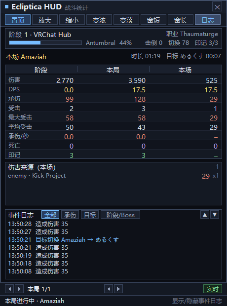

# Ecliptica HUD（C 语言实现）


VRChat 世界 **Ecliptica** 的战斗统计覆盖层：跟随 VRChat 日志，实时解析战斗事件，
以半透明置顶面板显示**阶段 / 本局 / 本场 Boss 战**三级统计、Boss 目标、DPS、承伤
与事件日志。

全部数据来自 VRChat 自己写的 `output_log`：**不注入、不修改游戏、不需要 OSC**。
纯 C + Win32/GDI 实现，只链接 `user32` / `gdi32`，无任何第三方依赖。



---

## 目录

- [特性](#特性)
- [快速开始](#快速开始)
- [命令行参数](#命令行参数)
- [界面操作](#界面操作)
- [配置文件](#配置文件)
- [日志解析规则](#日志解析规则)
- [工作原理](#工作原理)
- [目录结构](#目录结构)
- [测试与验证](#测试与验证)
- [兼容性与限制](#兼容性与限制)
- [致谢](#致谢)
- [许可证](#许可证)

---

## 特性

### 三级统计

| 层级 | 含义 |
|---|---|
| **阶段 Stage** | 当前关卡（`now in stage:` 之后累计）|
| **本局 Run** | 一次进入 Ecliptica 世界到离开 |
| **本场 Fight** | 一次 Boss 战（同一 Boss 的 `Phase2/Phase3` 视为续战并合并）|

每级都给出：伤害、DPS、承伤、受击次数、最大受击、平均受击、承伤/秒、死亡、印记。
DPS 使用可切换的滑动窗口：**3 / 5 / 10 / 30 / 60 / 120 秒**。

### 目标（仇恨）追踪

解析 `ownership of X transferred to Y`，**覆盖所有敌方单位**（Boss、杂兵、召唤物、
道具）。每个对象各自记住上一次的归属，**只有该对象的目标玩家真的换了才计一次**，
因此同一条 `ownership` 反复上报不会重复计数（`(Clone)` / `Phase2` 后缀会归并到同一对象）。

- 本局汇总显示累计切换次数
- Boss 行优先显示当前 Boss 的目标玩家与持续时间；取不到时回落到最近一次切换，
  并带上对象名（`Ice Squid → zukkiii 00:12`）
- 事件日志记录 `目标切换 <对象> → <玩家>`

> **注意：目标追踪依赖世界是否输出 `ownership` 行。**

### 其他

- **伤害来源分布**：按 `攻击者 · 招式` 聚合本场 / 本阶段 / 本局的承伤与次数
- **事件日志**：512 条环形缓冲，按类型着色，四个过滤器（全部 / 承伤 / 目标 / 阶段·Boss），
  支持点击切换、右键循环、▲▼ 翻看
- **历史回看**：底部箭头翻看历史局与历史 Boss 战，右侧徽标区分「实时 / 历史」
- **覆盖层交互**：拖动移动、8 个顶部按钮、关闭按钮、悬停提示、`Ctrl+Alt+Q` 全局退出
- **高 DPI 感知**：任意缩放下版式一致，不会因系统位图拉伸而发虚
- **演示模式**：`--demo` 内置模拟日志，无需 VRChat 即可查看完整界面

---

## 快速开始

### 环境要求

- Windows 10 / 11（x64）
- **二选一**：
  - [MinGW-w64](https://www.mingw-w64.org/)（gcc 8 及以上）
  - Visual Studio 2015 及以上（MSVC）

### 构建

**MinGW-w64**

```bat
mingw32-make
```

**MSVC**（在 `x64 Native Tools Command Prompt for VS 2022` 中）

```bat
build.bat
```

产物为 `ecliptica-hud-c.exe`（GUI 子系统，无控制台窗口）。

### 运行

```bat
ecliptica-hud-c.exe
```

直接双击即可：程序会去 `%USERPROFILE%\AppData\LocalLow\VRChat\VRChat\` 找**最新写入**
的 `output_log*.txt` 并开始跟随。想先看界面效果：

```bat
ecliptica-hud-c.exe --demo
```

---

## 命令行参数

| 参数 | 说明 |
|---|---|
| （无） | 自动定位 VRChat 日志，从末尾开始跟随 |
| `--demo` | 演示模式，内置按真实日志格式生成的模拟事件 |
| `--log <文件>` | 回放指定日志**并继续跟随新增内容**。该参数是独占的：文件打不开时不会退回自动定位，而是提示「打不开 --log 指定的文件」并每 2 秒重试 |
| `--tail` | 自动定位时也从头解析 |
| `--help` | 弹出帮助 |

### 日志定位顺序

1. `--log` 指定的文件
2. **VRChat 日志目录** `%USERPROFILE%\AppData\LocalLow\VRChat\VRChat\` 下
   `output_log*.txt` 中**最后写入时间最新**的一个。
   现行版本 VRChat 只写带时间戳的 `output_log_YYYY-MM-DD_HH-MM-SS.txt`（每次会话一个文件），
   旧版本写 `output_log.txt`，同一个通配即可覆盖。
   `USERPROFILE` 不可用时回退到 `%LOCALAPPDATA%\..\LocalLow\...`。
3. 仅当第 2 步一个都没找到时，才退回 exe 同目录 / 当前目录 / exe 上级目录中最新的
   `output_log*.txt`（方便把 exe 丢到日志旁边离线回放）

VRChat 开新会话时（目录里出现更新的文件）会自动切换跟随，并把当前局收尾。

---

## 界面操作

| 位置 | 操作 |
|---|---|
| 面板空白处 | 按住拖动移动窗口 |
| 顶部按钮 | 置顶 / 放大 / 缩小 / 变浓 / 变淡 / 窗短 / 窗长 / 日志 |
| 右上 ✕ | 关闭 |
| 事件日志标题栏 | 点击「全部 / 承伤 / 目标 / 阶段·Boss」切换过滤器；▲▼ 翻看 |
| 面板任意处右键 | 循环切换事件日志过滤器 |
| 底部箭头 | 翻看历史局（◀ ▶ 左侧）与历史 Boss 战（◀ ▶ 中间）|
| `Ctrl+Alt+Q` | 全局退出（任意窗口焦点下都有效）|

> 覆盖层刻意保留 `WS_EX_NOACTIVATE`，**不会抢 VRChat 的焦点**，所以退出请用
> `Ctrl+Alt+Q` 或点 ✕；`Esc` 只在窗口恰好获得焦点时生效。

---

## 配置文件

配置保存在 **exe 同目录**的 `config.ini`（UTF-8），退出时写回：

```ini
# Ecliptica HUD (C) config - UTF-8
always_on_top=1
alpha=210
scale=100
stat_window=10
show_event_log=0
win_x=538
win_y=71
ev_filter=0
# world_names: extra Ecliptica-family world names, separated by | or ,
world_names=
```

| 键 | 取值 | 说明 |
|---|---|---|
| `always_on_top` | 0 / 1 | 窗口置顶 |
| `alpha` | 40 – 255 | 整体不透明度 |
| `scale` | 60 – 200 | 界面缩放百分比 |
| `stat_window` | 3 / 5 / 10 / 30 / 60 / 120 | DPS 统计窗口（秒）|
| `show_event_log` | 0 / 1 | 是否显示事件日志面板 |
| `win_x` / `win_y` | 整数 | 窗口位置，`-1` 表示自动居中偏上 |
| `ev_filter` | 0 – 3 | 事件日志过滤器（全部 / 承伤 / 目标 / 阶段·Boss）|
| `world_names` | 字符串 | 追加的 Ecliptica 系世界名，`\|` 或 `,` 分隔 |

---

## 日志解析规则

解析器对 VRChat 日志的**消息体**做前缀匹配（VRChat 日志为无 BOM 的 UTF-8，
含中文世界名与中日文玩家名）。所有句式均取自真实 `output_log`：

| 事件 | 日志句式 |
|---|---|
| 进入世界 | `[Behaviour] Entering Room: <世界名>` |
| 离开世界 | `[Behaviour] OnLeftRoom` / `VRCApplication: HandleApplicationQuit` |
| 阶段开始 | `ECLIPTICA - now in stage: Stage_ProtoColony on phase: 0.1228879 as class: Nekomancer` |
| 间歇期 | `ECLIPTICA - now in intermission` |
| 大厅 | `ECLIPTICA - now in lobby` |
| Boss 战开始 | `ECLIPTICA - now fighting boss: Amaziah(Clone) on phase: 0.4321299` |
| Boss 击杀 | `Boss FlyLord dead, personal damage dealt:` |
| 击杀结算 | `STRIKE DMG: 4793` / `NON-STRIKE DMG: 615` |
| 造成伤害 | `Dealing 74 STRIKE damage` / `Dealing 38 NON-STRIKE damage` |
| 受到伤害 | `damage has been taken: 43, from source: (Peltapod) attack_Slam` |
| 目标（仇恨）切换 | `ownership of Amaziah transferred to OtherPlayer` |
| 死亡 | `Local controller dead, switching off.` |
| 印记 | `spawn token, True, 55` + `ECLIPTICA saving SESSION ID 11508` |
| 敌人工池 | `Initializing Enemy POOL ID17 as ENEMY ID 87` / `Retiring Enemy POOL ID19` |

### 两个容易踩的坑

**死亡连刷。** 一次死亡会在日志里连刷几十行 `Local controller dead, switching off.`
（实测 8 秒内 34 行），中间还会混进 `ECLIPTICA saving SESSION ID` 之类的无关行。
程序要求「上次死亡之后必须再次出现活着的证据（造成伤害 / 受到伤害 / 换阶段 / 开 Boss 战 /
出现印记）」，并叠加 3 秒静默期，因此一次死亡只计一次。

**名称映射。** 内置参考实现的显示名映射，例如
Boss：`FlyLord → Beelzebub`、`AntKing → Khepri`、`Obisidus → Irides`、`ManalyteAncient → Abaddon`；
阶段：`ProtoColony → Proto Colony`、`VRCHub → VRChat Hub`；
进度阶段：`0.43 → Antumbral`；
伤害来源：`(Khepri) attack_Claws2 → Khepri · Claws 2`、`NukeHitbox (BIG) → Nuke (big)`。


---

## 工作原理

```
VRChat output_log.txt
        │  vlog.c   定位 + 增量跟随（日志轮换自动重开）
        ▼
     parse.c      日志行 → 战斗事件（无状态前缀匹配）
        ▼
     stats.c      阶段 / 本局 / 本场三级模型 + 滑动 DPS 窗口 + 历史
        │            ├─ evlog.c   事件日志环形缓冲
        │            └─ evtext.c  事件 → 可读文本
        ▼  stats_view()  汇总成只读快照
     hud.c        版式计算 + GDI 双缓冲绘制
        ▼
     overlay.c    分层透明窗口 / 消息循环 / 交互
```

### 渲染与缩放

内存 DC 使用 `MM_ANISOTROPIC` 映射，把 **460×620 的逻辑坐标**等比放大到窗口像素，
再乘系统 DPI 系数。因此字体、间距、按钮在 60%–200% 任意缩放下都是**同一套版式**，
不会出现文字错位；`BitBlt` 前把映射复位为 `MM_TEXT`，避免源矩形被二次缩放。

### 版式

各区块矩形全部由 `hud_layout()` 一次算出，**绘制与命中测试共用同一份矩形**，
从结构上杜绝「面板互相压盖」：

```
标题行(26) → 按钮行(27) → 阶段/进度(42) → 本场 Boss(22)
→ 三级统计表(表头 18 + 9×19) → 伤害来源(自适应) → [事件日志(可选 142)]
→ 历史翻页条(26) → 底部状态栏(22)
```

事件日志关闭时释放的高度会自动分配给「伤害来源」列表（最多 14 行）。

---

## 目录结构

```
src/
├── main.c     入口：命令行解析、配置加载/保存、世界别名注册
├── overlay.c  覆盖层窗口：分层透明、置顶、DPI、消息循环、日志轮询接线
├── hud.c      HUD 版式计算 + GDI 双缓冲绘制 + 命中测试
├── cfg.c      config.ini 读写（UTF-8）
├── vlog.c     日志定位与增量跟随（VRChat 目录优先、日志轮换重开）
├── parse.c    日志行 → 战斗事件
├── names.c    Boss/阶段/进度阶段名称映射、来源美化、Ecliptica 系世界识别
├── stats.c    统计模型：三级统计 + 滑动 DPS 窗口 + 历史 + 目标追踪
├── evlog.c    事件日志环形缓冲
├── evtext.c   事件 → 事件日志文本（overlay 与 preview 共用）
├── format.c   数值/时间格式化（不依赖 Windows，可单元测试）
├── zhtext.h   中文界面文案
└── compat.h   编译器兼容垫片（MSVC / MinGW）
test_core.c    逻辑测试 + 日志回放摘要工具
preview.c      离屏界面预览工具
testdata/      回归夹具
```

---

## 测试与验证

### 单元测试

```bat
mingw32-make test
```

覆盖解析器、名称映射、世界识别、格式化、三级统计、DPS 窗口、阶段切换、Boss 续战、
目标追踪、死亡连刷、跨世界与事件日志，共 **160 项检查**。

### 日志回放摘要

```bat
test_core.exe <日志文件>
```

打印事件数、目标切换采纳数、各局统计，便于用真实日志校准：

```
lines=1552  events=415  accepted=375
ownership: parse 0 -> keep 0 (per-object, target really changed)
runs=1  in_run=0  stage_no=1  targets_total=0
all runs: deaths=1  kills=1  targets=0
```

### 离屏界面预览

```bat
mingw32-make preview
preview.exe <日志> <缩放%> <是否带日志面板 0/1> <输出.bmp> [只回放前 N 行]
```

把日志回放成统计状态再渲染成图片，**没有显示器也能检查排版**，改界面时可直接对比。

### 已验证项目

| 项目 | 结果 |
|---|---|
| 构建 | MinGW-w64 8.1.0，`-Wall -Wextra` **零警告零错误** |
| 单元测试 | **161 项检查全部通过** |
| 真实日志回放 | 单份 53834 行日志解析出 **9359 个事件** |
| 自动定位 | 无参数启动即跟随 VRChat 目录下 mtime 最新的 `output_log_*.txt` |
| 会话轮换 | 运行中新建更新的日志文件后自动切换跟随 |
| 死亡去抖 | 8 秒内 34 行死亡日志 → 计为 **1 次** |
| 目标追踪 | 官方世界 1544 条 `ownership` → 逐对象去重后采纳 **1342** 条|
| 界面 | 100% / 150% 缩放离屏渲染版式一致；DPI 感知下实机显示正常 |
| 交互 | 过滤器按钮点击切换、点击按钮不误触发拖动、`WM_CLOSE` 优雅退出并写回配置 |

---

## 兼容性与限制

- 仅支持 **Windows**（Win32 + GDI），未做跨平台适配。
- 日志只记录**你自己**造成的伤害，因此无法显示其他玩家的 DPS。
- **目标（仇恨）追踪依赖世界输出 `ownership` 行**：官方世界有，`男生女生向前冲`
  没有，后者「目标」会显示 `—`。日志里没有这份数据，程序无法凭空推断。
- 依赖 VRChat 日志格式；世界更新若改变输出句式，需同步调整 `src/parse.c`。
- 未实现 SteamVR 覆盖层与 Discord Rich Presence。
- 覆盖层为不抢焦点的工具窗口，退出快捷键固定为 `Ctrl+Alt+Q`。

---

## 致谢

- **[EclipticaHUD](https://github.com/RealWhyKnot/EclipticaHUD)** —— Rust 参考实现。
  本项目的日志格式知识、Boss / 阶段 / 进度阶段名称映射均以其为准，特此致谢。
- Ecliptica 世界作者与社区玩家。

---

## 许可证

[MIT](LICENSE)
